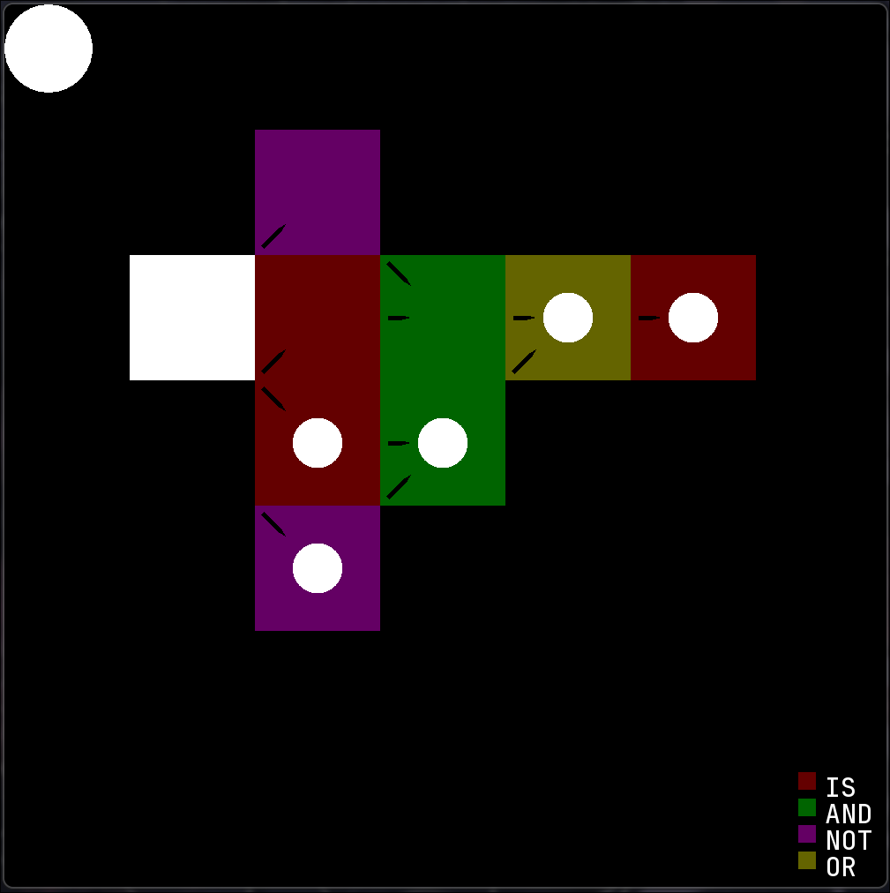

# SmartCells

Submission for the UF Open-Source Club Mini-Hackathon of 9/27/2025

We implemented a random boolean network (RBN) maker which consists of grid cells representing logic gates. Cells have binary states (0 or 1). Each cell takes input from 1 or 2 of its 8 neighboring cells (or itself). The cell will also have a type of gate associated with it (NOT, AND, OR, IS, INACTIVE, or ON). Every timestep, the cells will update their values based on value of their input cells and the gate operation they perform.

This RBN system is meant to challenge the user to implement their own more complex systems using the fundamental gates provided. The restriction of only taking input from adjacent cells makes this task <i>considerably</i> more difficult than traditional logic gates, which serves as an excellent, fun, and challenging puzzle exercise to improve the user's general understanding of logic gates and computation. Examples of systems we created so far using SmartCells include an XOR gate and a visually appealing loop of IS gates.

Our original plan included implementing a genetic algorithm to automatically evolve and perform simple computations and even control simple virtual organisms, but time constraints limited this goal. Pairing SmartCells with a genetic algorithm would have firmly classified this as an artificial intelligence project, as the RBN is basically an easily modifiable computation machine - with an added benefit of freeform recursive connections which allow for memory of past states. However, this currently remains a TODO and will be pursued sometime later in the future.

Requirements:
- Helps improve quality of life?
      - Serves as a cool sandbox puzzle game that is intellectually challenging, educational, and very fun.
- People interaction or systems interaction?
      - Allows people to freely interact with logical circuits and learn about computability.
- Ai/machine learning/computer vision/generative models?
      - If paired with genetic algorithms, it could be trained for certain computations or interesting tasks
- Novel?
      - Introduces a new type of neural network using binary values, logic gates, and recurrent freeform connections.

<figure>
  
  <figcaption>Figure: Logical XOR</figcaption>
</figure>

Idea brainstorm:
- time planner
- neuralink pain simulator
- interactive neural network teaching tool
- system akin to minecraft redstone
    + redstone ripoff
- arrow world
- cellular automata: simple rules lead to complex behavior
    + 3d game of life
    + game of life with customizable rules
    + simulife hub
    + particle life
    + morphogenesis
        + how do we make it AI?
            - focus on brain-heavy organisms: cells become neural networks
        + smartcells
    + boolean network
